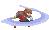

# Works Cited 
This is our works cited page for Project 3

* [PIXI.JS](https://www.pixijs.com/)
    * To help us render and do animation we are using PIXI.js. All of these file used are in the Code/js folder 
    * [Pixi documentation](https://pixijs.download/dev/docs/index.html)
    * This [website](https://medium.com/javascript-in-plain-english/platform-game-with-pixijs-part-1-ca2ed93c0808) also helped us get a better understanding of pixi
    * https://youtu.be/_HjQTzpbRK4
* [JSDoc](https://jsdoc.app/)
