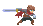

# EECS 448 Project 3 
Authors: Suhaib Ansari, Jianpeng Li, Ellen Vandewater, Brian Cheung, & Valerie Hernandez
 
## Project Overview 
For our EECS 448 project 3 we decided to create a platformer game. Similar to a Mario game. The goal of the game is to avoid enemies and get as many coins as possible before time runs out. 

## Installation 
To play our game all you gave to do is download the code to your machine locally, and open the index.html file using a live server.   Both [Atom] and [VS Code] have a live server extenstion availible to download and with instructions. 

## How To Play 
The goal of the game is to avoid emenies and grab as many coins as possible before time or your health runs out. 
* Use WAD to move
    * W to jump
    * A to go left
    * D to go right

## Documentation 
All documentation can be found in the [Documentation Folder]. 

[Atom]: https://atom.io/packages/atom-live-server
[VS Code]: https://marketplace.visualstudio.com/items?itemName=ritwickdey.LiveServer
[Documentation Folder]: Documentation